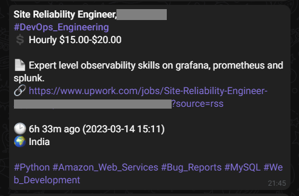

# Upwork Job Feed Notifier
This Python script fetches new job postings from one or more RSS feeds on Upwork and sends notifications to a Telegram chat with relevant job details.


## Usage
1. Clone the repository to your local machine.
2. Install the required libraries (`feedparser`, `requests`, `tzlocal`, and `bs4`) using pip.
3. Rename the `config-sample.json` file to `config.json` and update the contents with your own values.

    The `config.json` file contains the following settings:
    - `tgBotToken`: Your Telegram bot token.
    - `chat_id`: The chat ID of the Telegram chat to send notifications to.
    - `feed_url`: A list of URLs for the Upwork RSS feeds to monitor.
4. Run the script using python `upwork_job_feed_notifier.py`.

## Configuration
The `config.json` file contains the following settings:

- `tgBotToken`: Your Telegram bot token.
    <p>
    <details>
    <summary>How to get Telegram bot token</summary>

    1. Open Telegram and search for the "BotFather" bot.
    2. Start a chat with the BotFather by clicking on the "Start" button.
    3. Type `/newbot` and follow the instructions to create a new bot.
    4. Choose a name for your bot and a username that ends with "bot".
    5. BotFather will provide you with a unique Token for your bot.
    6. Save the Token in a safe place, as you will need it to communicate with your bot.

    </details>
    </p>
- `chat_id`: The chat ID of the Telegram chat to send notifications to.
    <p>
    <details>
    <summary>How to get chat ID</summary>

    1. Start a chat with your bot.
    2. Send any message to your bot.
    3. Open the following URL in your browser, replacing YOUR_BOT_TOKEN with the actual token for your bot:
        ```bash
        https://api.telegram.org/botYOUR_BOT_TOKEN/getUpdates
        ```
    4. Look for the `"chat":{"id":` value in the response. This is your chat ID.

    </details>
    </p>
- `feed_url`: A list of URLs for the Upwork RSS feeds to monitor.
    <p>
    <details>
    <summary>How to feed URL</summary>

    1. Log in to your Upwork account.
    2. Click on the "Find Work" tab in the top navigation menu.
    3. Select the category you're interested in, and then select the subcategory.
    4. Click on the "RSS" icon on the right side of the page.
    5. Copy the URL in your browser's address bar. This is the RSS feed URL for that category/subcategory.
    </details>
    </p>

# Setup script to run every interval

## Use runner.py

> Just run the script using python3 runner.py and it will ask to set the interval. Just type in the values or leave it blank to set it to run every hour.

<details>
    <summary>Old Method</summary>
    <h2>Set up a cron job to run this script</h2>
    1. Open your terminal and type crontab -e to open the crontab file in your default editor.
    2. Add a new line to the crontab file to specify when you want the script to run. For example, if you want the script to run every hour at minute 50, add the following line:
        ```bash
        50 * * * * /usr/bin/python3 /path/to/script/upwork_job_feed_notifier.py
        ```
        Replace /path/to/script.py with the actual path to your script file.
    3. Save and close the crontab file.
    4. The cron daemon will automatically start the script at the specified time. You can check the system log to verify that the script is running by typing `tail -f /var/log/syslog` in your terminal. If you see a message that says `CRON[xxx]: (username) CMD (/usr/bin/python3 /path/to/script/upwork_job_feed_notifier.py)`, it means the script is running.
</details>

## Screenshot of the notifiacation
